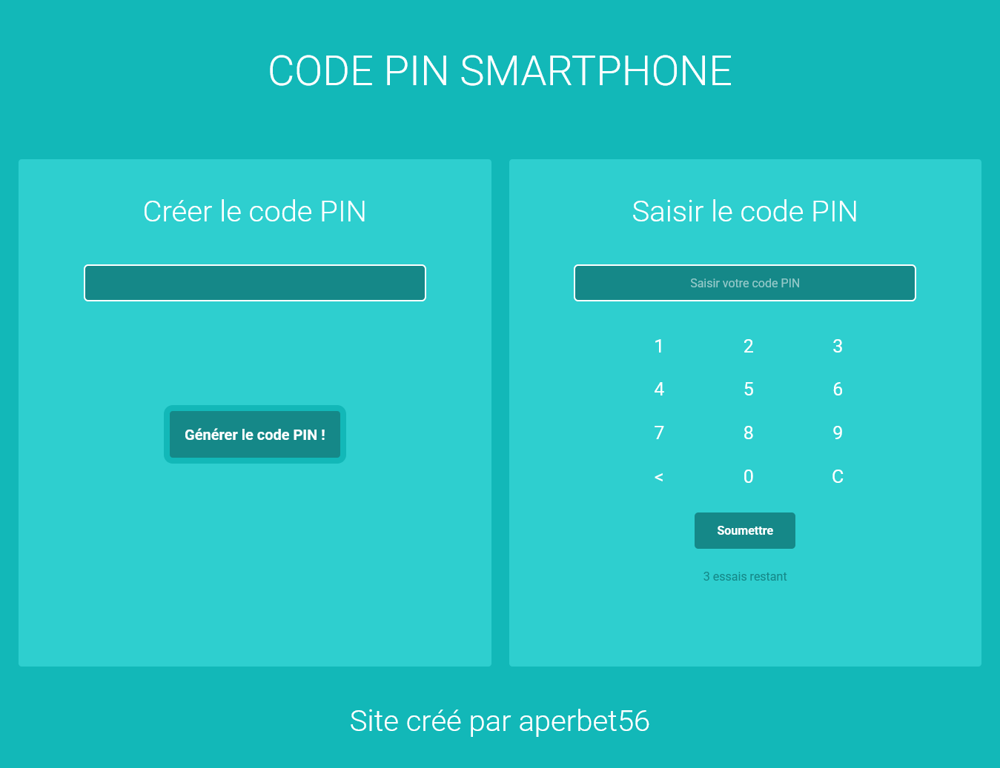

## CODE PIN SMARTPHONE 📱

## Le challenge

Création d'un générateur / vérificateur de code PIN pour smartphone en HTML5, CSS3, Bootstrap et JavaScript.

## Démonstration

Lien vers le projet : https://aperbet56.github.io/code_pin_smartphone/

## Projet développé avec

- Utilisation des balises sémantiques HTML5
- CSS3
- Bootstrap 5
- Animation css (transition)
- Utilisation d'un normaliseur : le fichier normalize.css
- Importation de la police "Roboto"
- Page web responsive
- Desktop first
- Commentaires HTML
- Commentaires CSS
- JavaScript
- Code JavaScript commenté
